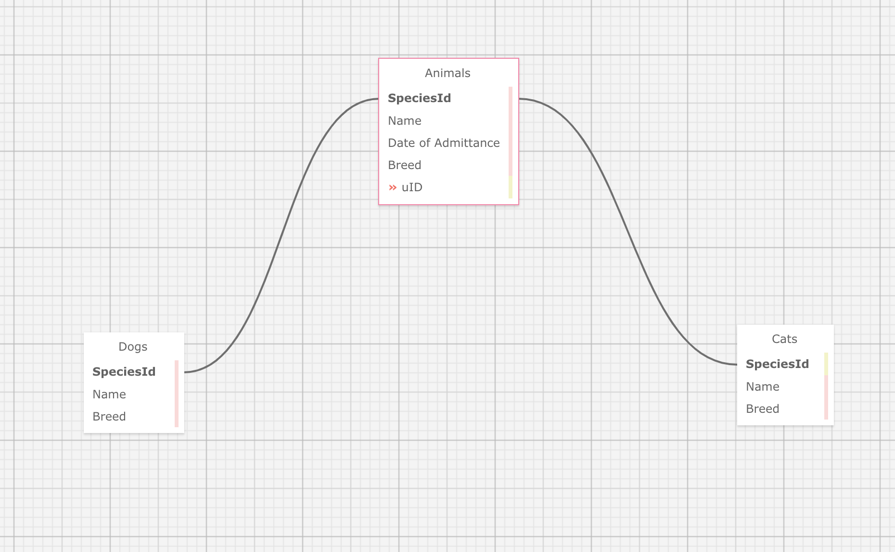

# Animal Shelter Tracker

  

### By **Jordan K, Julien Lenaz, Michael Connelly, Genesis Scott**

A shelter management application that allows workers to manage different types of animals and their details.

## Technologies Used

- .NET 5.0
- ASP.NET Core MVC
- Entity Framework Core
- Bootstrap
- C#
- HTML
- CSS

## Description

Animal Shelter Tracker is a web application tailored for animal shelters. This application aids shelter workers in efficiently managing the animals under their care. Features include:
- Add new animal types (e.g., cats, dogs, bunnies).
- Record crucial details for each animal: name, breed, and date of admittance.
- List animals by breed or type in alphabetical order.
- List animals by duration of stay, with the longest staying animals first.

## Setup/Installation Requirements

1. Ensure .NET SDK and runtime are installed on your machine.
2. Clone this repository to your local machine.
3. Navigate to the `AnimalShelterTracker.Solution` directory in your terminal.
4. Run the command `dotnet restore` to install necessary packages.
5. Run the command `dotnet build` to compile the application.
6. Run `dotnet run` to start the server and application.
7. Visit `localhost:5000` in your browser to access the Animal Shelter Tracker application.
8. Follow on-screen prompts to manage animal types and individual animals.

If you come across any difficulties or wish to give feedback, don't hesitate to get in touch or raise an issue on the repository.

## Known Bugs

- CSS styles might not be immediately applied because of caching challenges.
- There might be a need to manually stop the server (`Ctrl+C`) before executing `dotnet watch run` again.

## License

If you have queries, feedback, or are interested in contributing to the codebase, feel free to get in touch.

 

Copyright (c) 2023 Jordan Kennedy, Genisis Scott, Michael Connelly, Julien Lenaz